# WDProjLithiumCelisMagbanua
# Rebirth of Art
## Exploring the Artistic Revival of Europe
### Logo
### 
*****
### Description
This webpage will showcase different masterpieces across Europe during the renaissance as well as feature well-known masters of art. Not only that, but it will introduce people or the users to significant movements in artistic history, along with its contributors. Within the webpage, there will be interactive elements to provide the user a more entertaining yet educational experience.
*****
### Webpages
1. **Home:** This is the main page that will introduce the user to the purpose of our site. It will provide a brief intro to the European Renaissance.
2. **Art Styles (or Themes):** This page will contain the most prominent styles of art throughout the renaissance (e.g., Religious Art, Portraiture, Mythological Art, etc.). In each section or artstyle, a separate page will be linked to it which will include 1 or 2 featured artwork with interactive/clickable areas (e.g., zoom-in and text boxes for certain areas to provide an analysis) with other artworks shown under the featured one. A short paragraph definition and context will be included for each art styles' page (e.g., “What defines this art style?”) **#JS will be applied in this section**
3. **Artists:** This page provides a list of artists during the renaissance organized by country, with the most significant one having a context paragraph and the others under them. This will contain a portrait of the artist, their famous works, and a short biography.
4. **History:** This page will provide information on renaissance and its art as well as answer questions like: “What caused the renaissance?”, “What is the renaissance?”, “What made renaissance art thrive?”, etc.
5. **Quiz:** This page will contain a mini-quiz with 3 types: “Who made this artwork?”, “What is the title of this artwork?”, and basic trivia. This type will link to a separate page where the mini quiz will be conducted. **#JS will be applied in this section**
6. **Sources/Credits:** This page will list all the sources used in the webpage.
*****
#### Note:
**How will JS be used?**
* For the Art Styles Page, simple JS coding would be applied on the clickable areas of the artwork to scale it or add effects.
* In the Quiz Page, JS coding would be implemented possibly through the use of if-statements or  generally decision statements. A point system will be added to determine the scores.
*****

# FINAL MODIFICATION PROPOSAL
## How will CRUD be implemented to our webpage? 
1. **What is the purpose?** While users can already create and view comments, the addition of edit and delete features allows users to manage their previously submitted comments more effectively and generally completes the user experience and what is expected in a comment section system.  Firstly, the edit feature would allow the users to modify the content of an existing comment if they want to add information or change their comment. Whilst the delete feature gives users the ability to remove comments that are no longer relevant, were posted accidentally, or should no longer appear in the comment list. Overall, these features allow for a better user experience.
2. **How will it be used?** Each comment displayed in the comment section will have an options button “⋮,” and when clicked, it will provide the users with two buttons: edit and delete. When a user clicks the edit button, the user will be able to edit the text within the same comment box, allowing the user to modify the content. After editing, the updated comment will replace the previous version in the comment list. When the delete button is clicked, the system will remove the selected comment from the list after confirming the action (an alert prompt will be made: “Are you sure you want to delete this comment?”).
3. **How will data in localStorage be updated and removed?** All comments made are stored in the browser’s localStorage as an array of objects. When a user edits a comment, it updates the content of that comment in the array and saves the edited array back to localStorage, replacing the previous stored data. Whilst, when a user deletes a comment, the selected comment in the array would be removed using splice(). After the removal, the updated array is saved again to localStorage so that the deleted comment no longer appears when the page reloads. 

### Wireframes: DELETE
### 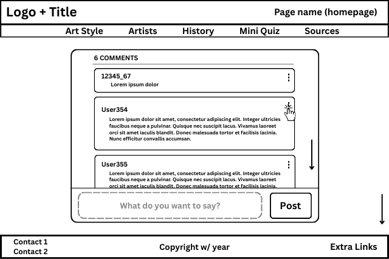

### 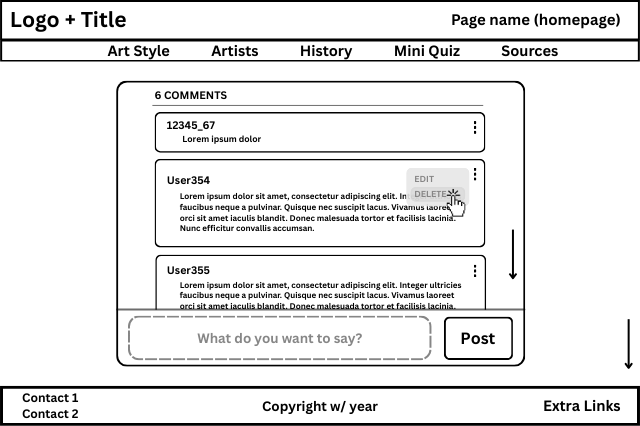

### 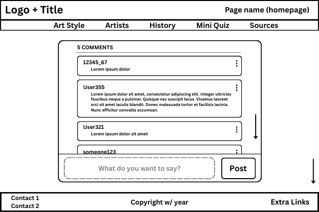

### Wireframes: UPDATE

### 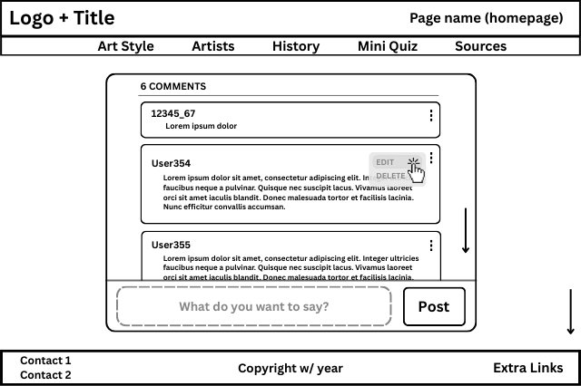

### 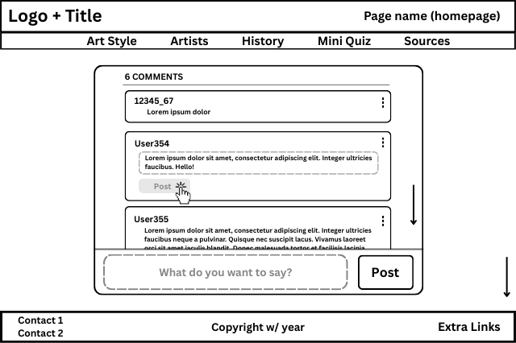

### 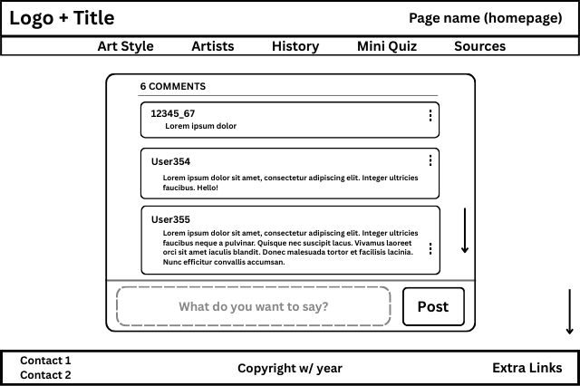

*****
### Wireframes
### Home
### 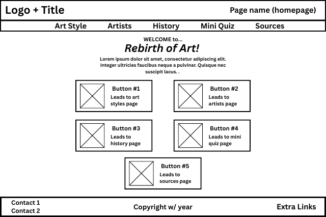

### Art Style
#### 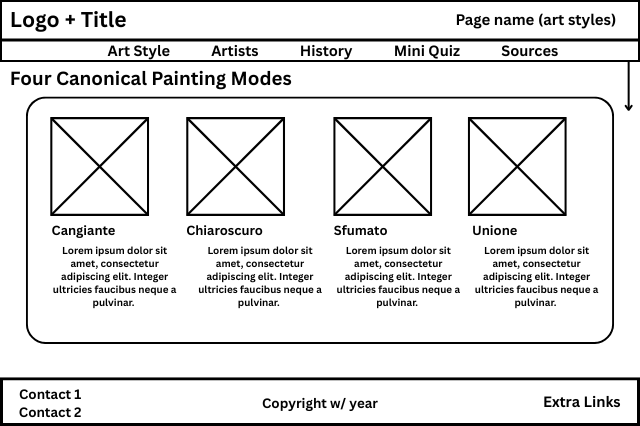
#### 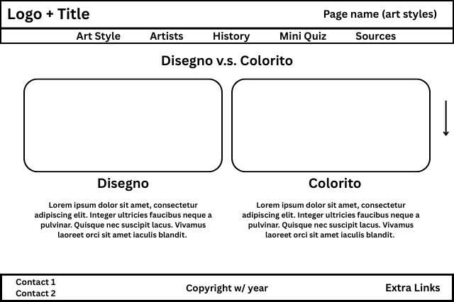
#### 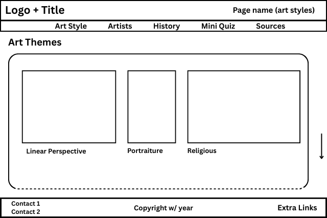
#### 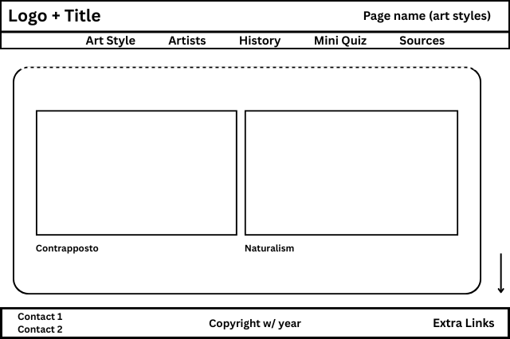

### Artists
### 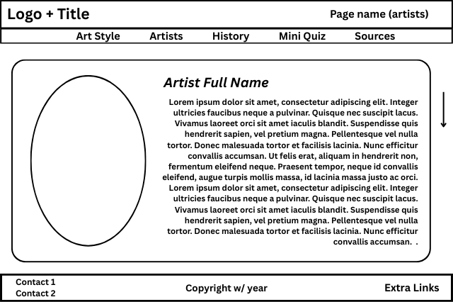
### 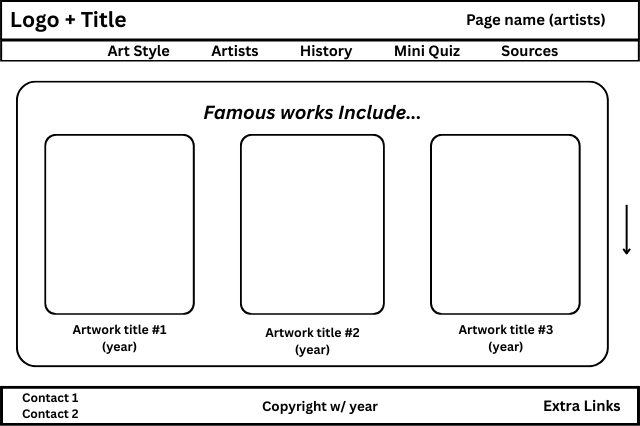

###  History
### 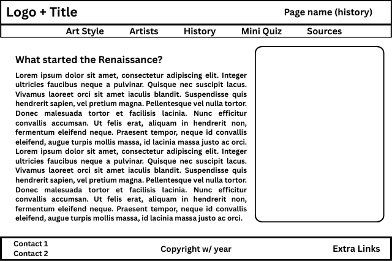
### 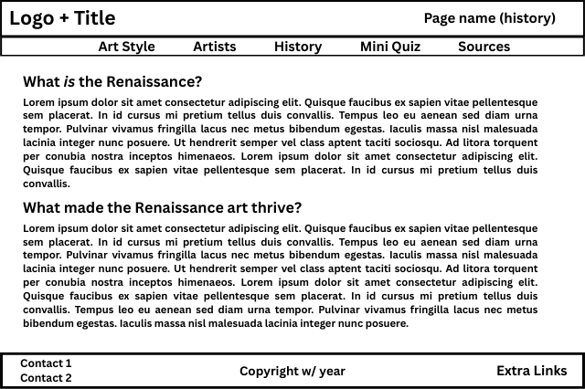

### Quiz
### 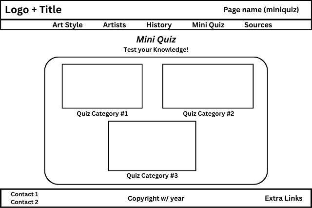
### 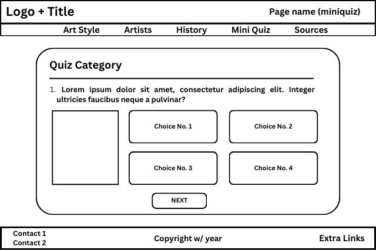
### 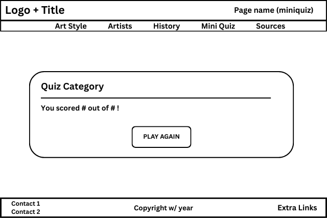

### Sources
### 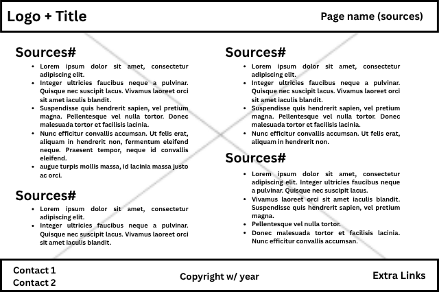

## How will HTML forms be added to our webpage?
1. **How will the HTML form be used?:** In the home page, we will include a simple comment system that allows users to submit comments, feedback, or questions, about the website. This form (using text area) will allow users to choose whether they want to stay anonymous or enter their name to post a comment message. 
2. **What is its purpose?:** The purpose of this is to make our website, while artistic, more interactive and academic through the use of feedback between users visiting our webpage. Additionally, if the user has questions on Renaissance, art, and other topics concerning our website, we will be able to respond and provide answers rather than keeping the webpage purely informational.
3. **How will data be saved?** Once the comment is submitted, the input data will be processed using JavaScript and saved in the user’s computer using the browser’s local storage. As the data is being processed, the JavaScript will get the input values and store them as part of an array of objects. Each object will contain relevant fields such as the user’s name (or anonymous) and comment message.

### Wireframes
### 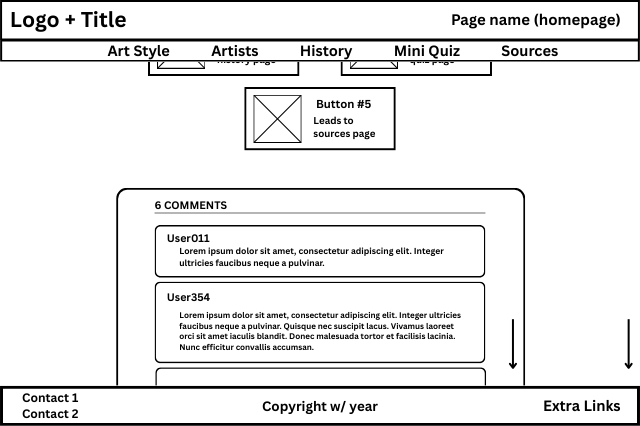

### 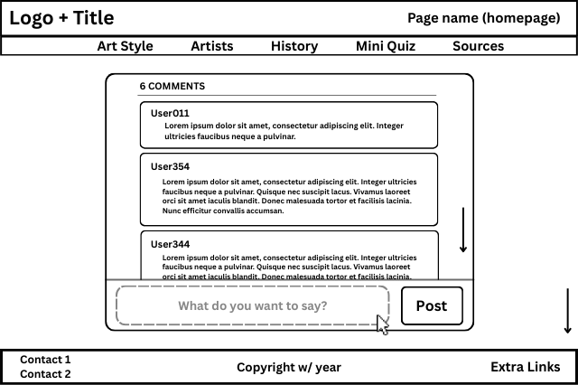

### 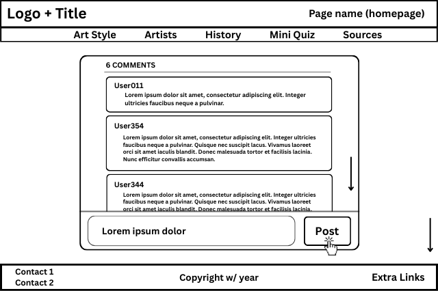

### 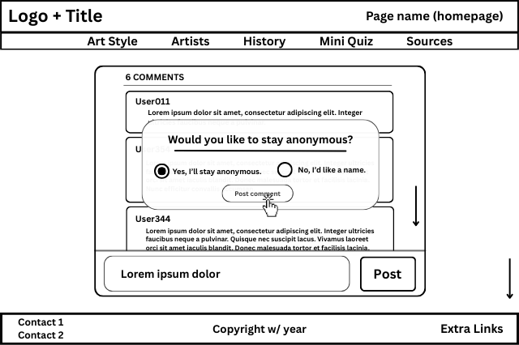

### 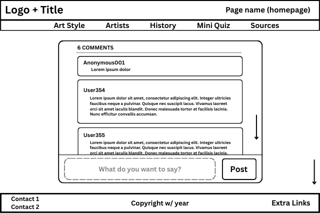

### 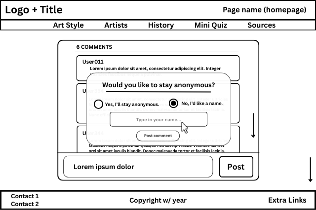

### 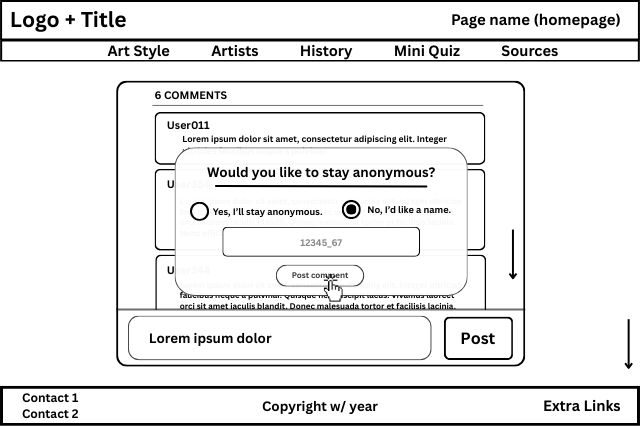

### 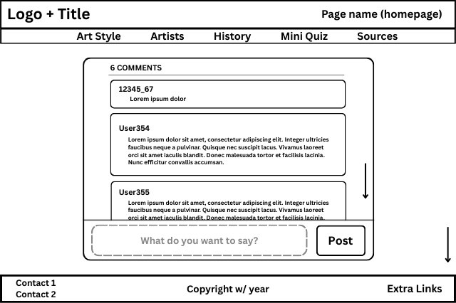

