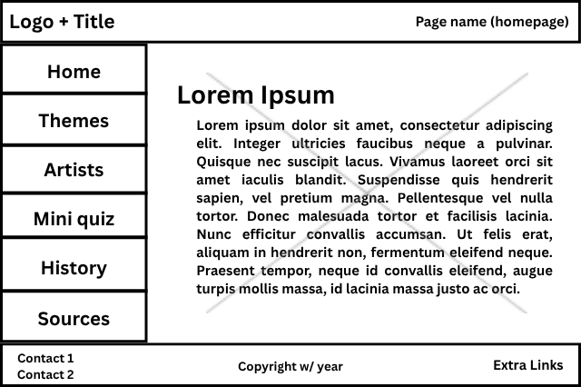
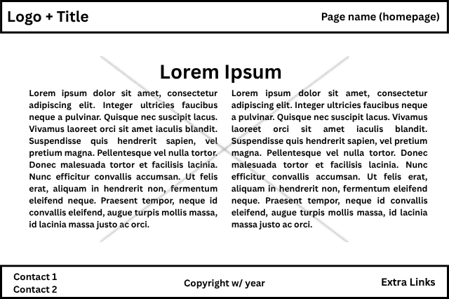
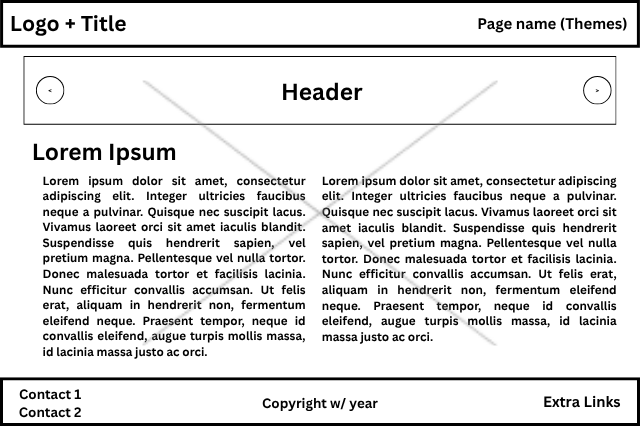
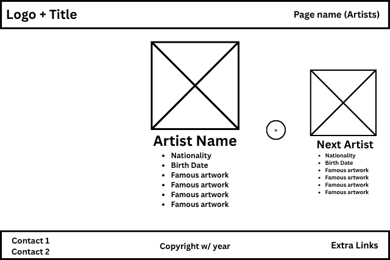
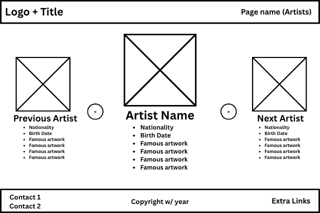
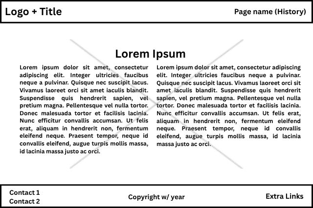
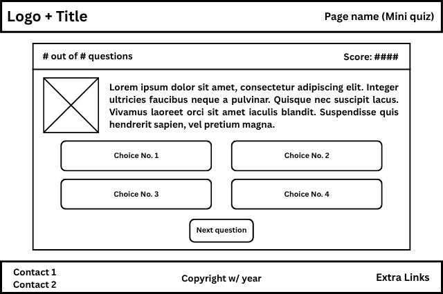
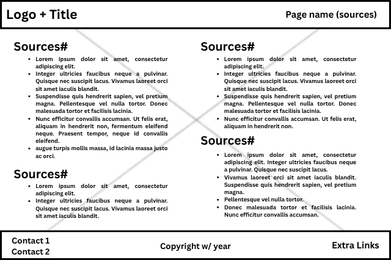

# WDProjLithiumCelisMagbanua
# Title
## subtitle
### Logo
### 
*****
### Description
This webpage will showcase different masterpieces across Europe during the renaissance as well as feature well-known masters of art. Not only that, but it will introduce people or the users to significant movements in artistic history, along with its contributors. Within the webpage, there will be interactive elements to provide the user a more entertaining yet educational experience.
*****
### Webpages
1. **Home:** This is the main page that will introduce the user to the purpose of our site. It will provide a brief intro to the European Renaissance.
2. **Art Styles (or Themes):** This page will contain the most prominent styles of art throughout the renaissance (e.g., Religious Art, Portraiture, Mythological Art, etc.). In each section or artstyle, a separate page will be linked to it which will include 1 or 2 featured artwork with interactive/clickable areas (e.g., zoom-in and text boxes for certain areas to provide an analysis) with other artworks shown under the featured one. A short paragraph definition and context will be included for each art styles' page (e.g., “What defines this art style?”) **#JS will be applied in this section**
3. **Artists:** This page provides a list of artists during the renaissance organized by country, with the most significant one having a context paragraph and the others under them. This will contain a portrait of the artist, their famous works, and a short biography.
4. **History:** This page will provide information on renaissance and its art as well as answer questions like: “What caused the renaissance?”, “What is the renaissance?”, “What made renaissance art thrive?”, etc.
5. **Quiz:** This page will contain a mini-quiz with 3 types: “Who made this artwork?”, “What is the title of this artwork?”, and basic trivia. This type will link to a separate page where the mini quiz will be conducted. **#JS will be applied in this section**
6. **Sources/Credits:** This page will list all the sources used in the webpage.
*****
#### Note:
**How will JS be used?**
* For the Art Styles Page, simple JS coding would be applied on the clickable areas of the artwork to scale it or add effects.
* In the Quiz Page, JS coding would be implemented possibly through the use of if-statements or  generally decision statements. A point system will be added to determine the scores.
*****

### Wireframes
#### Home
#### 
#### 

#### Art Style
#### 

#### Artists
#### 
#### 

####  History
#### 

#### Quiz
#### 

#### Sources
#### 
